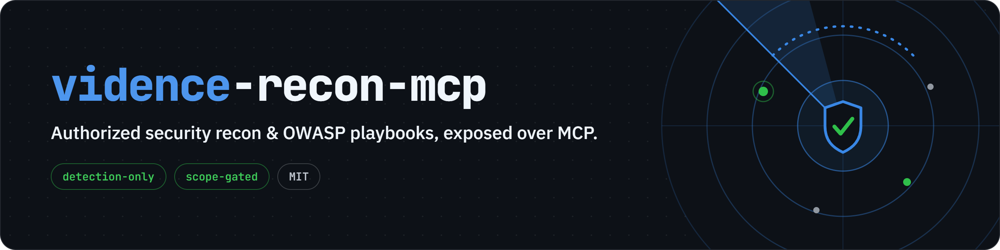

<p align="center">
  
</p>

<h1 align="center">vidence-recon-mcp</h1>

<p align="center">
  A safe, batteries-included <b>Model Context Protocol (MCP)</b> server that gives an AI client
  (Claude, or any MCP host) a curated set of security-testing tools and OWASP-aligned playbooks —
  <b>for authorized testing only.</b>
</p>

<p align="center">
  <b>Part of the <a href="https://vidence.io">Vidence</a> project</b> · security-led, EU-first
</p>

<p align="center">
  <a href="https://github.com/nkldjdev/vidence-recon-mcp/actions"></a>
  
  =18">
  
</p>

Point it at a web app or host **you own or are authorized to test**, ask your AI client to run
the `recon` or `web_owasp` playbook, and it will chain the right tools and hand back findings
with severity and remediation.

> ⚠️ **Authorized use only.** Running these tools against systems you do not own or have explicit
> written permission to test is illegal in most countries. See [DISCLAIMER.md](DISCLAIMER.md).
> You are solely responsible for how you use this software.

---

## Quick start (npx)

The **server** installs with no clone or build via `npx`. It still needs the **tools** — either
the `vidence-kali` container (below) or the tools on your own `PATH` (e.g. you're on Kali).

**1. Start the Kali tool host once** (build the image from a clone of this repo, or `docker pull`
it once an image is published):

```bash
docker build -t vidence-recon-mcp .          # from a clone of this repo
docker run -d --name vidence-kali \
  --cap-add=NET_RAW --cap-add=NET_ADMIN \
  --entrypoint sleep vidence-recon-mcp infinity
```

**2. Add the server to your MCP client** (Claude Desktop `claude_desktop_config.json`, Claude
Code, etc.):

```json
{
  "mcpServers": {
    "vidence-recon": {
      "command": "npx",
      "args": ["-y", "vidence-recon-mcp@latest"],
      "env": {
        "VIDENCE_RECON_MCP_ALLOWED_TARGETS": "example.com",
        "VIDENCE_RECON_MCP_RUNNER": "docker",
        "VIDENCE_RECON_MCP_CONTAINER": "vidence-kali"
      }
    }
  }
}
```

Restart the client, then ask it to run the `scope` tool. **Already on Kali** with the tools on
`PATH`? Drop step 1 and the `RUNNER`/`CONTAINER` env vars — the server runs the tools locally.
For the full manual options (all-in-one Docker image, native build), see **Running it** below.

---

## Why this exists

There are already thin "let an LLM run nmap" wrappers. This project is different in three ways:

1. **Methodology, not just tools.** Predefined, OWASP/PTES-aligned **playbooks** (`recon`,
   `web_owasp`, `web_quickscan`, `cms_wordpress`, `network_host`) chain tools and ask for a
   findings report — so you get an assessment, not a pile of raw output.
2. **Safety is structural.** A **scope allowlist** means no tool runs against a host you did not
   authorize (checked by resolved IP, including CIDR ranges). A **three-tier safety model**
   (`safe` / `active` / `intrusive`) gates aggressive tools, and a hard **blocklist** stops the
   destructive flags (`sqlmap --dump`, `--os-shell`, …) that would turn detection into an attack.
3. **Detection-focused by design.** It is an assessment toolkit, not an exploitation framework
   (see *Scope & philosophy*).

## Scope & philosophy

`vidence-recon-mcp` covers **reconnaissance, scanning, and vulnerability *detection***. It deliberately
does **not** ship turnkey exploitation or post-exploitation (no Metasploit exploit modules, no
data exfiltration, no reverse shells, no third-party credential cracking). That line is what
keeps the project legal to publish, trustworthy to run, and welcome in a community. The
architecture is extensible — you can add tools — but contributions that cross into weaponized
exploitation will not be merged into core.

## Tools

| Tool | Tier | What it does |
|---|---|---|
| `http_headers` | safe | HTTP response headers (curl) |
| `whatweb` | safe | Web tech/stack fingerprinting |
| `dns_enum` | safe | DNS records via dnsx |
| `tls_scan` | safe | TLS/SSL config + cert (sslscan) |
| `nmap_scan` | active | Ports + service/version |
| `nikto_scan` | active | Web server known-issue scan |
| `nuclei_scan` | active | ProjectDiscovery Nuclei templates |
| `dir_bruteforce` | active | Path/file discovery (gobuster) |
| `content_fuzz` | active | Fuzzing (ffuf) |
| `wpscan` | active | WordPress enumeration |
| `sqli_detect` | intrusive | SQLi **detection** via sqlmap (data-extraction flags blocked) |
| `scope` | — | Show authorized scope + enabled tiers |

Tools are declared as specs in [`src/tools/specs.ts`](src/tools/specs.ts) — adding one is a few
lines (see [CONTRIBUTING.md](CONTRIBUTING.md)).

## Playbooks (MCP prompts)

`recon` · `web_owasp` · `web_quickscan` · `cms_wordpress` · `network_host` — each takes a target
and produces a scoped, methodology-driven assessment. Defined in
[`src/playbooks.ts`](src/playbooks.ts).

## Running it — three ways

- **A) Docker all-in-one:** the image is **Kali + all the tools + Node + the server**; the MCP
  client runs the container with `docker run -i`. Simplest on **Linux/macOS**. ⚠️ **Not
  recommended on Windows** — Docker Desktop's `docker run -i` stdio is unreliable there and the
  server will disconnect. Use B instead.
- **B) Native server + Kali container (recommended on Windows):** run the server with `node` on
  the host, and it runs the tools via `docker exec` into a **persistent Kali container** built
  from this same image. The Claude↔server channel is native Node (reliable everywhere); only the
  tools run in Docker. No per-connection container startup.
- **C) Local Node:** run the server with `node` and supply the tools yourself on `PATH` (a
  Kali/Debian box or WSL). Node.js ≥ 18. A missing binary returns a clear "not found" message.

### A) Docker all-in-one (Linux/macOS)

```bash
git clone https://github.com/nkldjdev/vidence-recon-mcp.git
cd vidence-recon-mcp
docker build -t vidence-recon-mcp .   # Kali + tools + server; several GB, first build is slow
```

Point Claude at the container (MCP speaks over stdio):

**Claude Desktop** — `claude_desktop_config.json`:

```json
{
  "mcpServers": {
    "vidence-recon": {
      "command": "docker",
      "args": [
        "run", "-i", "--rm",
        "--cap-add=NET_RAW", "--cap-add=NET_ADMIN",
        "-e", "VIDENCE_RECON_MCP_ALLOWED_TARGETS=app.example.com,example.com",
        "vidence-recon-mcp"
      ]
    }
  }
}
```

**Claude Code (CLI):**

```bash
claude mcp add vidence-recon -- docker run -i --rm --cap-add=NET_RAW --cap-add=NET_ADMIN -e VIDENCE_RECON_MCP_ALLOWED_TARGETS=app.example.com vidence-recon-mcp
```

`NET_RAW`/`NET_ADMIN` let `nmap` run SYN scans. Prefer a config file over the env var? Mount it:
add `"-v", "/abs/path/config.json:/app/config.json"` to the args.

### B) Native server + Kali container (recommended on Windows)

Build the image (it's used as the tool host), start it as a **persistent idle container**, and
build the server to run natively:

```bash
git clone https://github.com/nkldjdev/vidence-recon-mcp.git
cd vidence-recon-mcp
docker build -t vidence-recon-mcp .                         # Kali + tools (several GB)
docker run -d --name vidence-kali \
  --cap-add=NET_RAW --cap-add=NET_ADMIN \
  --entrypoint sleep vidence-recon-mcp infinity              # idle Kali tool host
npm install && npm run build                                 # build the native server
```

Point Claude at the **native node server**, with runner set to `docker` so tools run via
`docker exec vidence-kali <tool>`:

**Claude Desktop** — `claude_desktop_config.json`:

```json
{
  "mcpServers": {
    "vidence-recon": {
      "command": "node",
      "args": ["C:\\path\\to\\vidence-recon-mcp\\dist\\index.js"],
      "env": {
        "VIDENCE_RECON_MCP_ALLOWED_TARGETS": "app.example.com,example.com",
        "VIDENCE_RECON_MCP_RUNNER": "docker",
        "VIDENCE_RECON_MCP_CONTAINER": "vidence-kali"
      }
    }
  }
}
```

The server talks to Claude over native stdio (reliable on Windows), and shells each tool into the
always-running `vidence-kali` container. After a reboot or Docker restart, bring the tool host
back with `docker start vidence-kali`. Both `node` and `docker` must be on the PATH Claude
launches with (they usually are); otherwise use full paths.

### C) Local Node

```bash
git clone https://github.com/nkldjdev/vidence-recon-mcp.git
cd vidence-recon-mcp
npm install && npm run build
cp config.example.json config.json    # then edit scope.allowedTargets
```

`config.json` (see [`config.example.json`](config.example.json)):

```jsonc
{
  "scope": { "allowedTargets": ["localhost", "127.0.0.1", "app.example.com", "10.0.0.0/24"] },
  "safety": { "allowActive": true, "allowIntrusive": false, "allowRawArgs": false, "minIntervalMs": 0 },
  "limits": { "commandTimeoutSec": 300, "maxOutputBytes": 1048576 }
}
```

Env overrides: `VIDENCE_RECON_MCP_CONFIG`, `VIDENCE_RECON_MCP_ALLOWED_TARGETS=a,b,c`,
`VIDENCE_RECON_MCP_ALLOW_INTRUSIVE=true`.

**Claude Desktop:**

```json
{
  "mcpServers": {
    "vidence-recon": {
      "command": "node",
      "args": ["/absolute/path/to/vidence-recon-mcp/dist/index.js"],
      "env": { "VIDENCE_RECON_MCP_CONFIG": "/absolute/path/to/vidence-recon-mcp/config.json" }
    }
  }
}
```

### Then run

Restart Claude and ask: *"Run the `web_quickscan` playbook against https://app.example.com"*
(the target must be in your allowlist). Start with `scope`, then the read-only `safe` tools,
then the playbooks.

## Safety model in one paragraph

Every tool call is (1) gated to its safety tier, (2) refused unless the target resolves entirely
within your allowlist, (3) built from structured parameters with **no shell** (so argument values
can't inject commands), and (4) screened against a destructive-flag blocklist. The server can't
enforce that *you* are authorized — that's on you, and you assert it by configuring scope — but
it makes misuse hard and accidents unlikely.

## Contributing

PRs welcome — especially new detection tools and playbooks. Please read
[CONTRIBUTING.md](CONTRIBUTING.md) and [CODE_OF_CONDUCT.md](CODE_OF_CONDUCT.md). Security issues in
*this server*: see [SECURITY.md](SECURITY.md).

## License

[MIT](LICENSE). The third-party tools this server invokes keep their own licenses; invoking them
as separate processes does not relicense them, but if you redistribute a Docker image that
*bundles* them you must honor their licenses.
