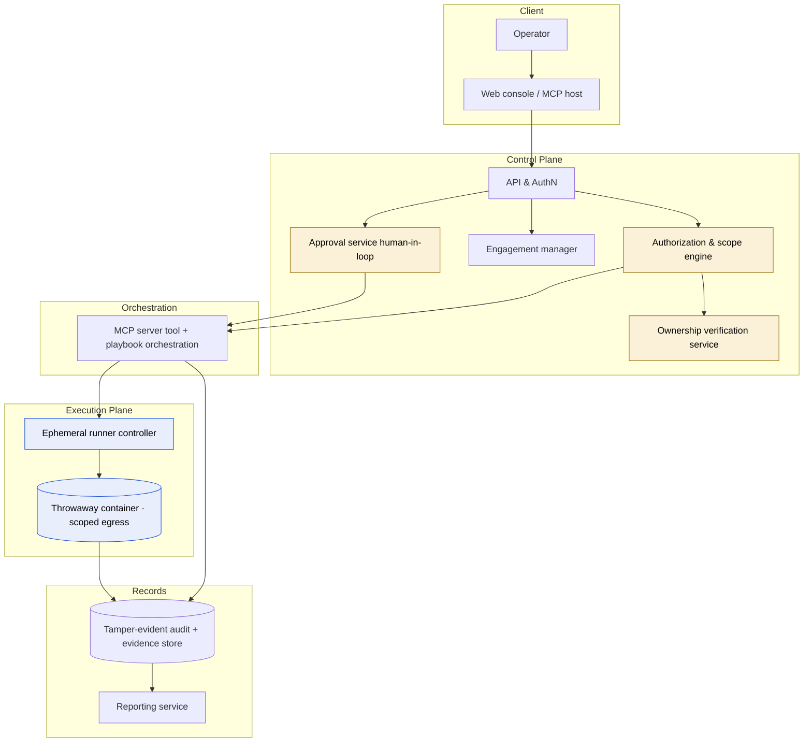

# Authorized Offensive Security Engine

**Architecture & Governance Design**

| | |
|---|---|
| **Project** | `vidence-recon-mcp` — offensive extension |
| **Status** | Draft for decision — design-level only, no implementation committed |
| **Author** | Nikola Djurović |
| **Date** | 9 October 2026 |
| **Related** | `README.md`, `DISCLAIMER.md` (this project's detection-only core) |
| **Classification** | Internal |

---

## 1. Purpose & intent

This document describes how this project could extend from its current **detection-only reconnaissance** server into a **full, authorized offensive testing platform** — an MCP-driven engine that chains advanced tools and predefined playbooks to pentest an application *the operator owns and has proven they control*.

The guiding principle is **ethical hacking with structurally-enforced authorization**: the engine must be incapable of acting against a target the operator has not cryptographically proven they control, and incapable of running destructive/offensive actions without an explicit human decision. Everything else in this design exists to make those two guarantees real rather than promised.

This is a **design and governance blueprint**, not an implementation. It deliberately contains no exploit code, payloads, or attack recipes. It specifies *how to gate and govern* established offensive tooling, not how to weaponize it.

---

## 2. Scope & non-goals

### In scope
- An authenticated, self-hostable engine that runs reconnaissance, enumeration, vulnerability detection, and — behind strong gates — **exploitation-class** tools against operator-owned assets.
- A predefined **playbook** system layering detection and (gated) offensive phases.
- A mandatory **ownership-verification** layer that confines all activity to proven-owned targets.
- **Human-in-the-loop** approval for every offensive/destructive action.
- Tamper-evident **audit and evidence** capture for legal defensibility.

### Explicit non-goals
- **No testing of third parties or customers.** The platform targets the operator's own applications and infrastructure, and (under a separate consent regime) the operator's own employees. It must never be usable against an operator's end-users/customers.
- **No autonomous exploitation.** The LLM/agent proposes; a human authorizes each offensive step.
- **No public, open, "install-everything" distribution of the offensive engine.** The detection layer stays open-source; the offensive engine is gated.
- **No credential theft, data exfiltration, persistence, or interception as turnkey features.** Where a tool can do these, the capability is blocked or isolated to non-destructive proof.

---

## 3. Legal & authorization foundation

The entire platform rests on one distinction: **authorization is proven, not asserted.** Three target classes, three rules:

| Target class | Allowed? | Basis / condition |
|---|---|---|
| Operator's own application & infrastructure | **Yes** | Ownership proven via verification (§5). Standard authorized pentest. |
| Operator's own employees (phishing / social-eng simulation) | **Conditional** | Separate consent regime: written policy, leadership/HR/legal sign-off, data-minimized, awareness-program framing. |
| Operator's customers / end-users | **Never** | No ownership, no consent. "They use my app" is not authorization. Hard-blocked. |

**Design consequence:** the system models *engagements* against *verified assets*, never free-text targets. A target that has not passed verification cannot be reached by any tool, at any tier.

---

## 4. System architecture

Seven planes, each with a single responsibility. Separation is a safety property: the component that *decides* is not the component that *acts*.



**Component responsibilities**

1. **Control plane / API + AuthN** — authenticates the operator; owns accounts, engagements, API tokens. Nothing runs without an authenticated session tied to an engagement.
2. **Authorization & scope engine** — the policy decision point. For every requested action it answers: is the target verified, in-scope, within an active engagement window, and is the requested tier permitted? A deny here stops everything downstream.
3. **Ownership-verification service** — issues and checks DNS/HTTP/signed challenges that bind a target to the operator (§5).
4. **Engagement manager** — lifecycle of an engagement: assets, verification status, time-box, enabled tiers, approvals, state.
5. **Approval service** — the human-in-the-loop gate for offensive actions (§7). Produces a signed, logged authorization token per action.
6. **MCP server (orchestration)** — exposes tools and playbooks to the agent/host, but calls nothing until the authorization engine (and, for offensive tiers, the approval service) has issued a token. This is the evolution of this project's current detection server.
7. **Execution plane** — an ephemeral-runner controller that spins a throwaway, network-restricted container per engagement, runs the gated tool, captures output, and destroys the container.
8. **Audit/evidence store + reporting** — append-only record of every decision, action, and artifact; feeds the professional per-scan reports.

---

## 5. Authorization & scope enforcement

### 5.1 Ownership verification (the core gate)

Before an asset becomes testable, the operator must prove control using one of these — the same mechanisms certificate authorities and search consoles use:

- **DNS challenge** — publish a unique `TXT` record (`_vidence-verify.<domain> = <nonce>`). Only someone controlling the domain's DNS can satisfy it.
- **HTTP file challenge** — serve a unique token at `https://<host>/.well-known/vidence-verify/<nonce>`. Proves control of the web root.
- **Signed scope-of-work** — for IP ranges / internal assets that cannot be DNS-verified, a counter-signed authorization record naming the ranges, window, and authorized actions.

Rules:
- Verification is **mandatory**, **per-asset**, **time-boxed**, and **re-checked** before each engagement (and periodically during long ones).
- Verification tokens expire; a lapsed asset reverts to untestable.
- Verification artifacts are stored as evidence (what was checked, when, by whom).

### 5.2 Scope resolution

- Every tool target is resolved to IP(s) at call time and checked against the engagement's verified asset set, including CIDR expansion (the current scope engine already does resolve-by-IP; this extends it).
- A **hard denylist** (RFC1918 unless explicitly in a signed internal SoW, cloud metadata endpoints, known shared infrastructure) prevents collateral or SSRF-style pivots.
- Redirects / discovered hosts are **not** auto-added to scope; they surface as suggestions requiring re-verification.

### 5.3 Tier model

| Tier | Example capability | Gate |
|---|---|---|
| **Safe** | Headers, fingerprint, DNS, TLS | Verified scope |
| **Active** | Port/service scan, Nikto, Nuclei, dir brute, WPScan | Verified scope + tier enabled |
| **Intrusive** | SQLi *detection*, auth-flow probing | Verified scope + tier enabled + rate-gated |
| **Exploit** | Validated exploitation, credential testing, chained PoC | Verified scope + **per-action human approval** + isolated runner + staging-preferred |

The jump from *Intrusive* to *Exploit* is the critical boundary: it adds **mandatory human approval** and **isolated execution**, and it is **off by default**. The current server already implements the Safe/Active/Intrusive tiers and a destructive-flag blocklist — this design builds the Exploit tier and its gates on top.

---

## 6. Execution model

- **Ephemeral, isolated runners.** Each engagement executes in a throwaway container, created per run and destroyed after. No standing environment, no reuse across engagements.
- **Egress firewalled to verified scope.** The runner's network policy permits traffic **only** to the engagement's resolved in-scope IPs. Even a misbehaving tool cannot reach anything else — this is the last line of defense if a scope check is ever bypassed upstream.
- **Staging-first for destructive tiers.** Exploit-tier playbooks target a staging mirror by default; production requires an additional explicit acknowledgment.
- **Gated tool integration.** Established offensive tools run as subprocesses *behind* the authorization + approval gates, built from structured parameters (no shell injection), with destructive sub-capabilities (data dump, shell, persistence, exfiltration) blocked or constrained to non-destructive proof-of-existence — mirroring how the current `sqli_detect` tool already blocks `--dump`/`--os-shell`.
- **Kill switch.** A single operator action (and an automatic trigger on anomaly/limit breach) halts all runners for an engagement immediately.

---

## 7. Human-in-the-loop approval

Autonomy stops at the exploit boundary.

- The agent may **plan and propose** an offensive action, presenting: target, exact action/tool, expected effect, tier, and why.
- A **human must approve each offensive action** before execution. Approval produces a short-lived, signed authorization token scoped to that one action + target; the MCP server refuses offensive execution without it.
- Approvals are **non-reusable** and **logged** (who, when, what).
- Batch/campaign approvals are permitted only within a single verified engagement and are still itemized in the audit log.

This is what keeps an LLM mistake bounded to "a proposal was declined" rather than "an exploit fired."

---

## 8. Playbooks

Playbooks extend the current model (`recon`, `web_owasp`, `web_quickscan`, `cms_wordpress`, `network_host`) into phased engagements:

```
Recon  →  Enumerate  →  Detect vulns  →  [GATE]  →  Validate/Exploit  →  Report
(safe)     (active)       (active/intr.)  human      (exploit tier,        (evidence
                                          approval    isolated, staging)    → PDF)
```

- **Detection phases** run freely within verified scope (as now).
- **Offensive phases** are declarative *intents* ("attempt to confirm exploitability of finding X") that the engine turns into gated, approval-required actions — never free-form attack scripting.
- Each playbook declares its maximum tier; an engagement can cap it lower.
- Example families: external web app, authenticated app (operator supplies test creds), API, network host, WordPress/CMS, and a separate **employee-awareness simulation** playbook under the §3 consent regime with credential capture disabled (records "clicked", never secrets).

---

## 9. Audit, evidence & compliance

- **Append-only, tamper-evident log** (hash-chained) of every authorization decision, approval, tool invocation, target, operator, and timestamp.
- **Evidence capture** per action: inputs, raw output, artifacts — reproduced verbatim, treated as untrusted data, feeding the report generator.
- **Data minimization**, especially for employee simulations: capture interaction metadata, never real credentials or personal content.
- **Retention & export** aligned to GDPR/EU expectations: defined retention, operator-scoped access, export for the operator's own records/compliance.
- The audit log is both the safety mechanism and the **legal defensibility record** that every action was verified, scoped, and (for offensive steps) human-approved.

---

## 10. Defense-in-depth summary

| Layer | Control | Failure it prevents |
|---|---|---|
| Identity | Authenticated engagement required | Anonymous/abusive use |
| Authorization | Proven ownership (DNS/HTTP/SoW) | Acting on unowned targets |
| Scope | Resolve-by-IP + CIDR + denylist | Collateral / off-scope drift |
| Tiering | Exploit tier off by default | Accidental destructive action |
| Human gate | Per-action approval + signed token | Autonomous exploitation |
| Isolation | Ephemeral runner, egress-locked to scope | Blast-radius if upstream check fails |
| Staging-first | Prod needs extra acknowledgment | Production damage / data loss |
| Audit | Hash-chained log + evidence | Non-repudiation / legal exposure |
| Kill switch | Manual + automatic halt | Runaway engagement |

No single control is trusted alone; the egress-locked runner backstops the authorization engine, and human approval backstops the agent.

---

## 11. Distribution & product model

- **Keep the detection layer open and public.** The current `vidence-recon-mcp` server stays MIT, detection-only — it drives community, adoption, and top-of-funnel.
- **The offensive engine is gated and not freely installable.** It ships as an authenticated, self-hostable component (or a hosted tier) — never as an "npx installs full offensive capability" package. This is both a safety and a legal necessity.
- **Two-product split:** open detection server (community) + gated offensive engine (authenticated, verified, audited). The split is what keeps the public project defensible while enabling real testing depth for verified operators.
- **Licensing:** offensive engine under a restricted/commercial license; the invoked third-party tools keep their own licenses (honor them in any bundled runner image).

---

## 12. Threat model (abuse cases & mitigations)

| Abuse attempt | Mitigation |
|---|---|
| Point the engine at a victim domain | Ownership verification fails → target untestable |
| Verify a domain, then re-target another | Per-asset verification; scope resolved per call; denylist |
| Coax the agent into autonomous exploitation | Exploit tier requires per-action human approval + signed token |
| Use detection findings to pivot/exfiltrate | Destructive sub-capabilities blocked; runner egress-locked |
| Attack operator's customers via the platform | Customer class hard-blocked; only operator-owned/employee scopes exist |
| Tamper with logs to hide activity | Hash-chained append-only audit; external anchoring optional |
| Reach internal/cloud metadata via SSRF | Denylist (RFC1918, 169.254.169.254) unless signed internal SoW |

---

## 13. Data model (core entities)

- **Operator** — account, billing, policy acceptance.
- **Asset** — a domain/host/range + verification method + verification status + expiry.
- **Engagement** — operator + asset set + time window + max tier + enabled playbooks + state.
- **Authorization** — verification artifacts bound to assets.
- **Approval** — per offensive action: actor, action, target, signed token, timestamp.
- **Action/Run** — tool, parameters, tier, runner id, status, evidence refs.
- **Finding** — observation, evidence, severity, remediation (feeds reports).
- **AuditRecord** — hash-chained entry referencing all of the above.

---

## 14. Technology fit

Builds on this project's existing patterns:

- **MCP server:** TypeScript, reusing the current server's spec-driven tool model, tiering, and resolve-by-IP scope engine. The offensive gates (verification check, approval-token requirement) slot in ahead of tool execution.
- **Control plane / API / authz / engagement / audit:** a small authenticated service + a relational store (e.g. Postgres) for engagements, assets, approvals, and the hash-chained audit log.
- **Execution plane:** ephemeral, egress-restricted containers on a dedicated runner host/pool (isolated from the control plane). This is where container isolation is load-bearing, not optional.
- **Reporting:** the already-built HTML→PDF generator (WeasyPrint) for per-scan professional documents.
- **Egress control:** per-runner firewall rules derived from the engagement's resolved scope.

---

## 15. Phased roadmap

1. **Phase 0 — Verification & engagement core.** Ownership verification (DNS/HTTP), engagement model, scope engine hardening, audit log. *No new offensive tools yet.* This alone upgrades the server from "asserted" to "proven" authorization.
2. **Phase 1 — Isolated execution + active/intrusive tiers.** Ephemeral egress-locked runners; move existing active/intrusive detection into them; reporting.
3. **Phase 2 — Human-approval gate.** Approval service + signed per-action tokens; still no exploit tools — the gate is built and tested first.
4. **Phase 3 — Exploit tier (operator infra).** Integrate validated exploitation behind the approval gate, staging-first, egress-locked. Operator-owned infrastructure only.
5. **Phase 4 — Employee-awareness simulations.** Separate consent regime, data-minimized, policy tooling. Only after the governance layer is proven.

Each phase is shippable and independently valuable; the offensive capability only arrives after the entire governance scaffold exists.

---

## 16. Open decisions

- Self-hosted-only vs hosted SaaS for the offensive engine (liability, data residency).
- Whether the exploit tier is offered at all, or capped at intrusive detection + manual validation guidance.
- External audit-log anchoring (e.g. periodic hash notarization) — needed for which customers?
- How test credentials for authenticated scans are supplied and stored (secrets handling).
- Insurance / terms-of-service / operator agreement language (legal counsel required before Phase 3).

---

## 17. Legal checklist (before any offensive capability ships)

- [ ] Written operator agreement asserting authorization and liability allocation.
- [ ] Mandatory ownership verification enforced in code (Phase 0).
- [ ] Customer/third-party targeting structurally impossible.
- [ ] Employee-simulation consent/policy framework reviewed by legal + HR.
- [ ] Tamper-evident audit with defined retention (GDPR-aligned).
- [ ] Jurisdiction review for distributing/operating offensive tooling.
- [ ] Clear incident/abuse-report process and takedown path.

---

*This is a design document. It commits no implementation and contains no offensive code or attack instructions. It specifies the authorization, isolation, approval, and audit controls under which established offensive tooling could be operated for authorized, ethical testing of the operator's own systems.*
